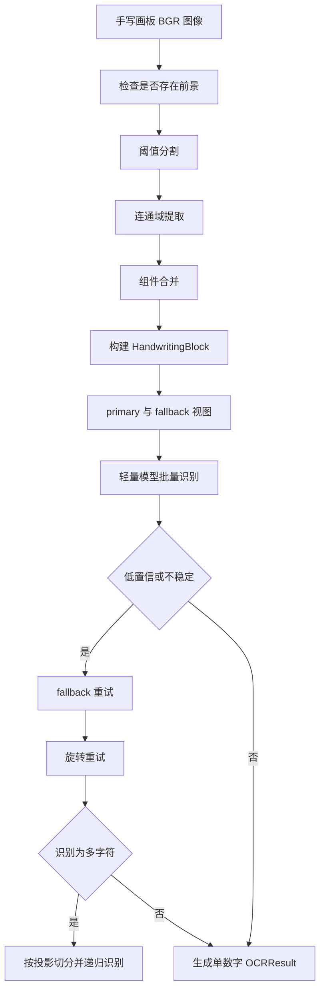
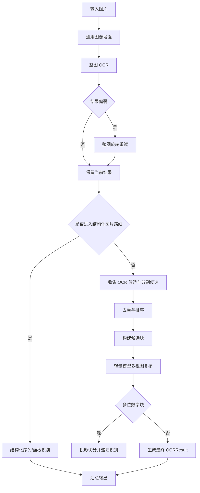
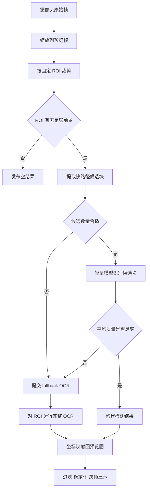

# 数字识别模型原理与实现说明

## 摘要

本文档基于当前仓库中的重构后源码，对 `DigitOCR_Project` 的数字识别系统进行说明。系统面向三类输入场景：

- 手写画板数字识别
- 本地图片数字识别
- 摄像头实时数字识别

当前实现不是单一端到端模型，而是“统一服务门面 + 场景化 pipeline + OCR 引擎 + 图像预处理 + 摄像头运行时”的组合式架构。系统通过 PaddleOCR 的整图检测识别能力、轻量文本识别能力、候选区域分割、多视图复核、固定 ROI 实时识别和跨帧稳定化等机制，实现面向数字场景的较高鲁棒性与可维护性。

与重构前版本相比，当前源码已经完成职责拆分：

- `core/recognition_service.py` 只保留服务门面和装配
- 识别逻辑进入 `core/pipelines/`
- 摄像头实时链路拆分到 `camera/` 下多个模块
- GUI 从单体类拆分为 `desktop/controllers/` 下的控制器集合

## 关键词

数字识别；OCR；PaddleOCR；手写数字识别；图像预处理；实时摄像头识别；分层架构

## 1. 项目目标与设计原则

本项目的核心目标不是“识别任意文本”，而是围绕数字场景构建一套更稳定、更可控的 OCR 应用系统。当前实现遵循以下原则：

1. 不同输入场景共用同一套服务门面和结果结构。
2. 通用 OCR 负责大范围检测与基础识别，轻量模型负责候选块复核。
3. 手写、图片、摄像头三条链路分别优化，但输出形式保持统一。
4. 摄像头模式优先保证实时性，再通过 fallback 路径补足复杂场景。
5. 通过模块分层降低 GUI、OCR、运行时之间的耦合。

## 2. 当前源码架构

### 2.1 总体结构

当前与识别流程直接相关的源码主要分布如下：

```text
DigitOCR_Project/
  core/
    recognition_service.py
    service_public_api.py
    service_types.py
    geometry.py
    result_mapping.py
    ocr_engine.py
    image_processor.py
    pipelines/
      handwriting_pipeline.py
      image_pipeline.py
      camera_digit_pipeline.py
      board_sequence_pipeline.py
  camera/
    runtime.py
    runtime_lifecycle.py
    runtime_loop_facade.py
    runtime_worker_control.py
    digit_loop.py
    board_loop.py
    roi.py
    fast_path.py
    overlay.py
    protocol.py
    state.py
    mode_profiles.py
  desktop/
    controllers/
      recognition_controller.py
      handwriting_controller.py
      image_controller.py
      camera_controller.py
      result_panel_controller.py
  gui_app.pyw
  main.py
```

### 2.2 分层职责

#### GUI 与交互层

- `gui_app.pyw`
  - 创建应用窗口、Tk 变量和 UI 布局
  - 装配各个 controller
- `desktop/controllers/`
  - `handwriting_controller.py` 负责手写画板采集与提交
  - `image_controller.py` 负责图片选择、预览和图片识别提交
  - `camera_controller.py` 负责摄像头启动、轮询、预览和模式切换
  - `recognition_controller.py` 负责统一的后台任务、状态和结果提交流程
  - `result_panel_controller.py` 负责结果表格、预览、复制和保存

#### 服务门面层

- `core/recognition_service.py`
  - 当前只承担门面与装配职责
  - 创建 `ImageProcessor`、`DigitOCREngine`
  - 按需懒加载四个 pipeline
- `core/service_public_api.py`
  - 保留公开方法：
    - `recognize_image`
    - `recognize_handwriting`
    - `recognize_camera_frame`
    - `recognize_board_frame`

#### 识别 pipeline 层

- `core/pipelines/handwriting_pipeline.py`
  - 手写区域分割、归一化、旋转重试、连写切分
- `core/pipelines/image_pipeline.py`
  - 图片模式主流程、整图旋转重试、候选融合
- `core/pipelines/camera_digit_pipeline.py`
  - 摄像头数字模式快路径与 fallback 逻辑
- `core/pipelines/board_sequence_pipeline.py`
  - 黑板模式整行数字序列识别

#### OCR 引擎与预处理层

- `core/ocr_engine.py`
  - 对 PaddleOCR 的整图 OCR 与轻量文本识别能力做统一封装
- `core/image_processor.py`
  - 负责放大、双边滤波、CLAHE、锐化等增强流程

#### 摄像头运行时层

- `camera/runtime.py`
  - 对外暴露 `CameraOCRRuntime` facade
- `camera/runtime_lifecycle.py`
  - 摄像头开启、关闭、ROI 更新、快照读取
- `camera/runtime_loop_facade.py`
  - 推理循环的调度入口
- `camera/digit_loop.py`
  - 数字模式实时循环
- `camera/board_loop.py`
  - 黑板模式实时循环
- `camera/runtime_worker_control.py`
  - worker 进程创建、队列调度与结果回收
- `camera/roi.py`
  - 固定 ROI 裁剪与缩放
- `camera/fast_path.py`
  - 摄像头快路径候选块提取、检测结果构造与稳定化支持

## 3. 核心模型与数据结构

### 3.1 OCR 引擎结构

当前系统使用两类 OCR 能力。

#### 通用整图 OCR

`core/ocr_engine.py` 中的 `DigitOCREngine.recognize()` 使用 PaddleOCR 对整张图像进行检测和识别，输出标准化后的 `OCRResult` 列表。每个结果包含：

- `text`
- `score`
- `box`

该路径适用于：

- 图片模式整图初筛
- 摄像头 fallback OCR
- 黑板模式整行序列 OCR

#### 轻量候选块识别

`DigitOCREngine.recognize_handwriting_blocks()` 使用 `TextRecognition` 模型对已经裁好的候选数字块进行快速识别，返回 `TextOnlyResult` 列表。该能力适用于：

- 手写候选块识别
- 图片候选块复核
- 摄像头快路径小块识别

这使系统形成了“整图 OCR 提议 + 候选块轻量复核”的双层识别结构。

### 3.2 数字约束

系统通过 [config/digits_dict.txt](D:/PaddleOCR/DigitOCR_Project/config/digits_dict.txt) 加载允许字符集，默认只保留数字字符，从而减少非数字字符误识别对最终结果的干扰。

### 3.3 统一输出结构

`core/service_types.py` 中定义了多个值对象，其中最重要的是：

- `RecognitionOutput`
  - `source_name`
  - `input_image`
  - `processed_image`
  - `annotated_image`
  - `results`
  - `warnings`
- `ImageCandidate`
- `ImageCandidateBlock`
- `ImageReviewResult`
- `HandwritingBlock`
- `StructuredSequence`

这套结构保证 GUI、CLI 和测试都能围绕同一组输出对象工作。

## 4. 图像预处理原理

### 4.1 通用预处理

`core/image_processor.py` 中的 `ImageProcessor.enhance()` 主要包含以下步骤：

1. 小图放大
2. 双边滤波降噪
3. LAB 空间 CLAHE 对比度增强
4. 锐化

该流程用于图片模式和部分摄像头输入预处理。

### 4.2 场景化预处理差异

`DigitOCRService` 中维护了两套处理器：

- `processor`
  - 用于常规图片识别
  - 默认将最短边放大到 `720`
- `camera_processor`
  - 用于摄像头与黑板模式
  - 放大比例更保守，滤波参数更轻

这意味着系统并不是对所有输入完全复用同一套增强参数，而是按场景做了轻量配置分化。

## 5. 统一服务门面设计

### 5.1 DigitOCRService 的当前定位

在当前源码中，`core/recognition_service.py` 已经不再承载全部业务逻辑，而是转为门面层。其职责主要是：

1. 创建 `ImageProcessor`
2. 创建 `DigitOCREngine`
3. 保存场景阈值和复核参数
4. 按需创建四个 pipeline
5. 暴露统一公开方法

这一点与旧版本最大的区别在于：识别逻辑已经从 God object 中拆出。

### 5.2 公开接口

服务门面保留了以下稳定接口：

- `recognize_image`
- `recognize_handwriting`
- `recognize_camera_frame`
- `recognize_board_frame`

这些方法由 `core/service_public_api.py` 实现，内部再委托到不同 pipeline。

## 6. 手写识别链路

### 6.1 输入与表示

手写模式由 `desktop/controllers/handwriting_controller.py` 负责采集。用户在 Tk 画板上的笔迹会同步写入内存中的 `PIL.Image`，识别时再转成 OpenCV 的 BGR 图像交给服务层。

这种设计的优点是：

- 不依赖对界面截图
- 可在窗口 resize 后按笔迹重建画板
- 便于得到干净的白底黑字输入

### 6.2 手写 pipeline

手写主流程位于 `core/pipelines/handwriting_pipeline.py` 及其 mixin 中。



### 6.3 关键策略

#### 前景校验

在真正识别前，`_validate_handwriting_content()` 会检查画板是否存在足够前景，防止空白画板直接进入 OCR。

#### 连通域提取与合并

`core/pipelines/handwriting_segmentation.py` 中通过二值化和 `connectedComponentsWithStats` 提取组件，再根据距离和重叠关系保守合并，避免一个数字被拆成太多碎块。

#### 多视图重试

每个手写块会构建：

- `primary_image`
- `fallback_image`

若初次识别结果质量不够高，就会启用 fallback 视图重试。仍不理想时，再根据前景角度估计进行旋转重试。

#### 连写切分

如果轻量模型把某个块识别成多个字符，系统会认为该块可能存在连写，并根据投影切分成子块，再递归复核。

## 7. 图片识别链路

### 7.1 当前图片链路定位

图片模式使用 `recognize_image()` 入口，由 `core/pipelines/image_pipeline.py` 负责主体逻辑。它并不是简单执行一次整图 OCR，而是包含“整图识别、候选融合、结构化路线、候选复核、fallback 合并”多个阶段。

### 7.2 图片识别流程



### 7.3 关键策略

#### 整图旋转重试

`ImageRecognitionPipeline._retry_rotated_image_results()` 会根据前景方向估计生成多个候选角度，先用轻量模型快速预览，再选出最优角度跑整图 OCR。

#### 候选融合

图片链路的候选框不只来自 OCR 检测结果，也来自图像分割路径。两条来源最终融合成 `ImageCandidate`，提高召回率。

#### 候选块复核

单个候选区域会构造成 `ImageCandidateBlock`，再由轻量模型从多个视角进行复核，最终聚合为 `ImageReviewResult`。

#### 结构化图片路线

如果图片中存在较明显的数字行列结构，系统会进入 `image_structured.py`、`image_structured_sequence.py` 和 `image_structured_panel.py` 路线，对长序列或面板式区域进行专门处理。

这一路径适合：

- 表格数字
- 规则排布的多位数字
- 一整行需要按位拆分的数字序列

## 8. 摄像头识别链路

### 8.1 当前设计变化

当前摄像头实现与旧版相比有两个重要变化：

1. 实时逻辑已经拆分为 facade + loop + worker 控制模块。
2. 黑板模式已经收敛为“固定手动 ROI + 整行 OCR”路线，不再依赖旧的自动黑板定位链路。

### 8.2 CameraOCRRuntime 的职责

`camera/runtime.py` 中的 `CameraOCRRuntime` 对外保留统一运行时接口：

- `start`
- `stop`
- `get_snapshot`
- `update_roi_size`

实际实现则拆分到多个模块：

- 生命周期：`camera/runtime_lifecycle.py`
- 循环调度：`camera/runtime_loop_facade.py`
- worker 控制：`camera/runtime_worker_control.py`
- 数字模式循环：`camera/digit_loop.py`
- 黑板模式循环：`camera/board_loop.py`

### 8.3 摄像头数字模式

数字模式的整体思路是“先快后重”。



关键点包括：

- `camera/roi.py`
  - 负责固定 ROI 裁剪
- `camera/fast_path.py`
  - 提取候选块和检测结果
- `camera/digit_loop.py`
  - 调度快路径 worker 与 fallback worker
- `camera/mode_profiles.py`
  - 定义数字模式的线程数、OCR 间隔等参数

### 8.4 摄像头黑板模式

黑板模式的当前实现更直接：

1. 仍然先取固定手动 ROI
2. 对 ROI 做缩放后直接走 `recognize_board_frame`
3. 保留多字符 OCR 结果，不强制拆成单个数字

对应实现：

- 运行时循环：`camera/board_loop.py`
- 服务 pipeline：`core/pipelines/board_sequence_pipeline.py`

这意味着当前黑板模式更适合“识别框内一整排数字序列”，而不是复杂场景下的自动黑板定位。

### 8.5 实时稳定化

摄像头识别结果不会直接原样显示给用户，GUI 层还会进一步做：

- 低置信度过滤
- 检测框稳定化
- 序列历史缓存
- 过期结果清空

相关逻辑主要由：

- `camera/fast_path.py`
- `camera/state.py`
- `desktop/controllers/camera_controller.py`

共同完成。

## 9. 软件工程层面的重构结果

当前源码已经完成以下结构性改进，这些变化也影响了系统原理的表达方式：

### 9.1 服务层从单体类转为门面

旧版 `DigitOCRService` 同时承担图片、手写、摄像头、几何映射和结果修正。当前版本改为：

- `recognition_service.py` 只负责门面与装配
- 几何映射进入 `geometry.py` 与 `result_mapping.py`
- 识别逻辑进入 `core/pipelines/`

### 9.2 摄像头运行时拆分

旧版摄像头逻辑集中在单个大文件。当前已经拆分为：

- ROI
- fast path
- digit loop
- board loop
- worker control
- protocol/state

这使得“实时推理原理”和“生命周期管理”可以分开理解。

### 9.3 GUI 从单类拆分为多 controller

当前 GUI 已不再由一个超大类同时处理所有功能，而是分成：

- 手写 controller
- 图片 controller
- 摄像头 controller
- 识别任务 controller
- 结果面板 controller

这让识别原理和界面逻辑的边界更加清晰。

## 10. 源码映射

### 10.1 入口层

- `gui_app.pyw`
- `main.py`

### 10.2 服务与公共结构

- `core/recognition_service.py`
- `core/service_public_api.py`
- `core/service_types.py`
- `core/geometry.py`
- `core/result_mapping.py`

### 10.3 OCR 与图像处理

- `core/ocr_engine.py`
- `core/image_processor.py`

### 10.4 场景化 pipeline

- `core/pipelines/handwriting_pipeline.py`
- `core/pipelines/image_pipeline.py`
- `core/pipelines/camera_digit_pipeline.py`
- `core/pipelines/board_sequence_pipeline.py`

### 10.5 摄像头运行时

- `camera/runtime.py`
- `camera/runtime_lifecycle.py`
- `camera/runtime_loop_facade.py`
- `camera/runtime_worker_control.py`
- `camera/digit_loop.py`
- `camera/board_loop.py`
- `camera/roi.py`
- `camera/fast_path.py`
- `camera/protocol.py`
- `camera/state.py`
- `camera/mode_profiles.py`

### 10.6 GUI 控制器

- `desktop/controllers/recognition_controller.py`
- `desktop/controllers/handwriting_controller.py`
- `desktop/controllers/image_controller.py`
- `desktop/controllers/camera_controller.py`
- `desktop/controllers/result_panel_controller.py`

## 11. 系统优点与局限

### 11.1 优点

- 三条主链路共享统一服务门面，复用度高。
- 使用通用 OCR 与轻量复核组合，兼顾检测能力与数字场景适配。
- 摄像头数字模式具备快路径与 fallback 双路线，实时性较好。
- 黑板模式保留多字符结果，更符合整行数字场景。
- 重构后模块职责清晰，便于维护和继续扩展。

### 11.2 局限

- 手写连写、重叠严重时，投影切分仍可能失败。
- 图片模式对复杂背景和极端拍摄透视仍然敏感。
- 摄像头模式识别效果依赖 ROI、光照与目标摆放位置。
- 当前数字约束以字典和后处理为主，并未使用专门训练的数字端到端模型。

### 11.3 可扩展方向

- 引入专门面向数字场景训练的小模型
- 为手写与打印体分别建立更细粒度策略
- 在图片结构化路线中增加更强的版面分析
- 为实时视频加入更完善的跟踪与时序建模

## 12. 结论

当前版本的 `DigitOCR_Project` 已经形成一套较完整的数字识别工程实现。其核心思想不是依赖单一 OCR 模型直接输出最终答案，而是通过：

- 图像预处理
- 通用 OCR 提议
- 轻量候选块复核
- 场景化 pipeline
- 固定 ROI 实时运行时
- 结果稳定化与统一输出结构

共同完成对数字场景的识别。

从源码结构上看，当前系统已经具备比较明确的工程分层：GUI、服务门面、pipeline、OCR 引擎、摄像头运行时彼此边界清楚，这也使本文档能够更准确地从“模块协作系统”而不是“单文件实现”来解释项目原理。
