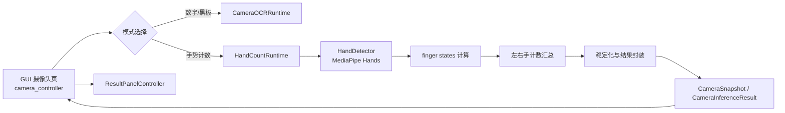

# 基于现有 DigitOCR 项目的 MediaPipe 多手掌手指计数功能实施设计

## 1. 文档目标

本文档只输出实施设计，不编写功能代码。

目标是在现有 Windows 桌面程序入口 [gui_app.pyw](D:/PaddleOCR/DigitOCR_Project/gui_app.pyw) 的基础上，新增一个“摄像头多手掌手指计数模式”，实现以下能力：

- 同时检测最多两只手
- 统计每只手伸出的手指数
- 将两只手的结果累加为 `0-10`
- 在现有摄像头页内展示实时结果、左右手贡献数、FPS 和骨架绘制

本次方案基于你当前项目的既有分层，不把 MediaPipe 手势计数逻辑硬塞进现有 OCR 算法层，而是作为一条并行的摄像头识别能力接入现有 GUI。

本文档同时承担“项目结构总览”的作用。后续如果在新的窗口、新的终端进程或新的 AI 会话中继续推进本项目，应优先阅读本文档，而不是重新全量扫描整个仓库。

---

## 1.1 当前项目完整结构地图

### 1.1.1 项目定位

当前项目 [DigitOCR_Project](D:/PaddleOCR/DigitOCR_Project) 是一个以“数字识别”为核心的桌面应用，现有能力包括：

- 手写数字识别
- 本地图片数字识别
- 摄像头实时数字识别
- 摄像头黑板模式整排数字识别
- CLI 批量图片识别
- Windows GUI 打包运行

它不是单脚本项目，而是一个已经拆分为：

- 启动自举层
- 核心识别服务层
- 摄像头运行时层
- 桌面 GUI 控制层
- 测试与工程检查层

的分层仓库。

### 1.1.2 根目录结构与职责

#### [bootstrap/](D:/PaddleOCR/DigitOCR_Project/bootstrap)

职责：

- 启动前运行环境检查
- 虚拟环境切换
- 调用 `bootstrap_env.py` 完成依赖准备

关键文件：

- [bootstrap/support.py](D:/PaddleOCR/DigitOCR_Project/bootstrap/support.py)

结论：

- 这是应用可直接运行的重要支撑层，不是业务逻辑层

#### [camera/](D:/PaddleOCR/DigitOCR_Project/camera)

职责：

- 现有 OCR 摄像头模式的运行时
- ROI 管理
- 预览叠框
- 快路径与 fallback 调度
- 多线程 / 多进程摄像头推理管理

关键文件：

- [camera/config.py](D:/PaddleOCR/DigitOCR_Project/camera/config.py)
- [camera/runtime.py](D:/PaddleOCR/DigitOCR_Project/camera/runtime.py)
- [camera/runtime_lifecycle.py](D:/PaddleOCR/DigitOCR_Project/camera/runtime_lifecycle.py)
- [camera/runtime_loop_facade.py](D:/PaddleOCR/DigitOCR_Project/camera/runtime_loop_facade.py)
- [camera/runtime_worker_control.py](D:/PaddleOCR/DigitOCR_Project/camera/runtime_worker_control.py)
- [camera/digit_loop.py](D:/PaddleOCR/DigitOCR_Project/camera/digit_loop.py)
- [camera/board_loop.py](D:/PaddleOCR/DigitOCR_Project/camera/board_loop.py)
- [camera/state.py](D:/PaddleOCR/DigitOCR_Project/camera/state.py)
- [camera/overlay.py](D:/PaddleOCR/DigitOCR_Project/camera/overlay.py)
- [camera/roi.py](D:/PaddleOCR/DigitOCR_Project/camera/roi.py)

结论：

- `camera/` 目前主要服务于 OCR 摄像头能力
- 新的 hand-count 功能需要复用其模式常量、ROI 和快照接口思想，但不应继续复用其 OCR worker 主链

#### [config/](D:/PaddleOCR/DigitOCR_Project/config)

职责：

- 存放 OCR 业务配置和环境 bootstrap 配置

关键文件：

- [config/digits_dict.txt](D:/PaddleOCR/DigitOCR_Project/config/digits_dict.txt)
- [config/env_bootstrap.json](D:/PaddleOCR/DigitOCR_Project/config/env_bootstrap.json)

结论：

- 这里是“配置输入层”，不是代码逻辑层

#### [core/](D:/PaddleOCR/DigitOCR_Project/core)

职责：

- 数字识别的核心服务与算法门面
- OCR 引擎封装
- 图片、手写、摄像头、黑板模式的 pipeline

关键文件：

- [core/recognition_service.py](D:/PaddleOCR/DigitOCR_Project/core/recognition_service.py)
- [core/service_public_api.py](D:/PaddleOCR/DigitOCR_Project/core/service_public_api.py)
- [core/ocr_engine.py](D:/PaddleOCR/DigitOCR_Project/core/ocr_engine.py)
- [core/image_processor.py](D:/PaddleOCR/DigitOCR_Project/core/image_processor.py)
- [core/messages.py](D:/PaddleOCR/DigitOCR_Project/core/messages.py)
- [core/service_types.py](D:/PaddleOCR/DigitOCR_Project/core/service_types.py)
- [core/pipelines/](D:/PaddleOCR/DigitOCR_Project/core/pipelines)

结论：

- `core/` 是“识别算法和结果组织层”
- GUI 和 camera runtime 都不应在这里直接堆界面逻辑

#### [data/](D:/PaddleOCR/DigitOCR_Project/data)

职责：

- CLI 默认输入输出目录

结构：

- [data/input](D:/PaddleOCR/DigitOCR_Project/data/input)
- [data/output](D:/PaddleOCR/DigitOCR_Project/data/output)

结论：

- 主要服务 CLI 和演示样例
- GUI 并不强依赖这里的图片内容

#### [desktop/](D:/PaddleOCR/DigitOCR_Project/desktop)

职责：

- 桌面 GUI 相关控制器与显示辅助

关键文件：

- [desktop/messages.py](D:/PaddleOCR/DigitOCR_Project/desktop/messages.py)
- [desktop/media.py](D:/PaddleOCR/DigitOCR_Project/desktop/media.py)
- [desktop/controllers/camera_controller.py](D:/PaddleOCR/DigitOCR_Project/desktop/controllers/camera_controller.py)
- [desktop/controllers/image_controller.py](D:/PaddleOCR/DigitOCR_Project/desktop/controllers/image_controller.py)
- [desktop/controllers/handwriting_controller.py](D:/PaddleOCR/DigitOCR_Project/desktop/controllers/handwriting_controller.py)
- [desktop/controllers/recognition_controller.py](D:/PaddleOCR/DigitOCR_Project/desktop/controllers/recognition_controller.py)
- [desktop/controllers/result_panel_controller.py](D:/PaddleOCR/DigitOCR_Project/desktop/controllers/result_panel_controller.py)

结论：

- `desktop/` 是应用 UI 的控制层
- 新功能如果入口放在现有窗口中，主要改动一定会落在这里

#### [docs/](D:/PaddleOCR/DigitOCR_Project/docs)

职责：

- 保存重构路线、验收记录、环境文档

关键文件：

- [docs/refactor_roadmap.md](D:/PaddleOCR/DigitOCR_Project/docs/refactor_roadmap.md)
- [docs/final_refactor_acceptance.md](D:/PaddleOCR/DigitOCR_Project/docs/final_refactor_acceptance.md)
- [docs/environment_bootstrap.md](D:/PaddleOCR/DigitOCR_Project/docs/environment_bootstrap.md)

结论：

- 它不是运行时所需代码，但有重要背景信息

#### [tests/](D:/PaddleOCR/DigitOCR_Project/tests)

职责：

- 单元测试
- 行为锁定测试
- GUI / camera / bootstrap / service 合约测试

结论：

- 这是当前项目防回归的安全网
- 新功能接入后必须补测试，而不是只改主代码

#### [tools/](D:/PaddleOCR/DigitOCR_Project/tools)

职责：

- 工程检查脚本

关键文件：

- [tools/check_module_sizes.py](D:/PaddleOCR/DigitOCR_Project/tools/check_module_sizes.py)

结论：

- 用来控制文件长度和结构健康度

#### [build/](D:/PaddleOCR/DigitOCR_Project/build)

职责：

- 打包中间产物

结论：

- 不参与源码运行逻辑

#### [.runtime/](D:/PaddleOCR/DigitOCR_Project/.runtime)

职责：

- bootstrap 缓存
- PaddleX / PaddleOCR 模型缓存
- 日志和报告

结论：

- 是运行时缓存层，不是源码层

#### [.venv/](D:/PaddleOCR/DigitOCR_Project/.venv)

职责：

- 项目独立 Python 环境

结论：

- 是环境层，不是项目业务代码层

### 1.1.3 根目录关键入口文件

#### [gui_app.pyw](D:/PaddleOCR/DigitOCR_Project/gui_app.pyw)

职责：

- GUI 主入口
- 初始化 Tk 应用状态
- 创建各类 controller
- 负责 UI 装配，不负责深层业务算法

判断：

- 这是“桌面入口和装配根节点”

#### [main.py](D:/PaddleOCR/DigitOCR_Project/main.py)

职责：

- CLI 批量识别入口
- 从 `data/input` 读图
- 调用 `DigitOCRService`
- 将结果保存到 `data/output`

判断：

- 它与 GUI 是平行入口，不是 GUI 的子模块

#### [bootstrap_env.py](D:/PaddleOCR/DigitOCR_Project/bootstrap_env.py)

职责：

- 跨平台环境准备脚本
- 负责 `.venv` 创建、依赖安装、缓存和报告

判断：

- 这是项目的启动基础设施文件，不是业务功能文件

#### [DigitOCR_GUI.spec](D:/PaddleOCR/DigitOCR_Project/DigitOCR_GUI.spec)

职责：

- PyInstaller 打包配置

判断：

- 新依赖能否随 GUI 正确打包，最终都要落到这里确认

### 1.1.4 当前项目的核心运行链路

#### 链路 A：GUI 图片 / 手写识别

```text
gui_app.pyw
  -> desktop/controllers/recognition_controller.py
  -> core/recognition_service.py
  -> core/service_public_api.py
  -> core/pipelines/*
  -> core/ocr_engine.py
```

说明：

- `RecognitionController` 管理 OCR service 生命周期和后台线程
- `DigitOCRService` 是门面
- 具体识别逻辑在 pipeline 中

#### 链路 B：GUI 摄像头 OCR 模式

```text
gui_app.pyw
  -> desktop/controllers/camera_controller.py
  -> camera/runtime.py
  -> camera/*loop.py
  -> core/recognition_service.py
  -> core/ocr_engine.py
```

说明：

- 这是当前“数字模式 / 黑板模式”的主链
- `camera_controller` 是 GUI 与 runtime 的连接点

#### 链路 C：CLI 批处理模式

```text
main.py
  -> core/recognition_service.py
  -> core/ocr_engine.py
```

说明：

- CLI 不经过 desktop/controller
- 也不经过 camera runtime

### 1.1.5 当前摄像头 OCR 能力的模式划分

#### 模式 1：数字模式

特点：

- 单帧内识别 ROI 中数字
- 有快路径和 fallback 路径
- 结果会按检测框输出并做稳定化

#### 模式 2：黑板模式

特点：

- 偏向整排数字序列识别
- 保留整段结果，不强拆为单字符

#### 本次准备新增的模式 3：手势计数模式

特点：

- 不再走 OCR
- 改为 MediaPipe Hands 检出最多两只手
- 统计伸出的手指总数

### 1.1.6 当前项目的结果展示机制

结果展示目前统一依赖：

- [desktop/controllers/result_panel_controller.py](D:/PaddleOCR/DigitOCR_Project/desktop/controllers/result_panel_controller.py)

它负责：

- 摘要文本
- 结果表格
- 结果预览图
- 复制结果文本
- 保存结果图

结论：

- 新功能如果进入现有 GUI，最好继续复用这套右侧面板，而不是另外开一套展示控件

### 1.1.7 当前项目的状态管理机制

主要状态集中在：

- [gui_app.pyw](D:/PaddleOCR/DigitOCR_Project/gui_app.pyw) 的 `_initialize_app_state(...)`

特点：

- 应用状态字段很多
- controller 共享 app 上的状态变量

结论：

- 新模式接入时，要么新增少量 hand-count 专用字段
- 要么给 `CameraInferenceResult` 增加 payload 承载 mode-specific 数据
- 不建议把大量临时状态散落到多个 controller 私有成员中

### 1.1.8 当前项目的测试结构

当前测试已经覆盖：

- bootstrap
- camera runtime
- GUI camera 关键行为
- service 合约
- image mode
- 保存行为
- OCR engine 线程行为

结论：

- 当前仓库不是“无测试项目”
- 所以后续 hand-count 接入，必须沿用这个风格补测试

### 1.1.9 当前项目的扩展原则

为了避免后续会话重复审查整个仓库，后续扩展请优先遵守以下原则：

- 入口不变：
  - GUI 入口仍是 [gui_app.pyw](D:/PaddleOCR/DigitOCR_Project/gui_app.pyw)
  - CLI 入口仍是 [main.py](D:/PaddleOCR/DigitOCR_Project/main.py)
- GUI 扩展优先走 controller，不直接把业务逻辑塞进 `gui_app.pyw`
- 摄像头模式扩展优先在 `camera_controller` 做模式分流
- 新算法能力优先新增独立 package，而不是继续把不相干逻辑压进 `camera/` OCR 文件
- 结果展示尽量复用现有右侧结果面板
- 新依赖最终都要验证 `requirements.txt`、bootstrap 和 `DigitOCR_GUI.spec`

### 1.1.10 后续新会话的最小必读文件清单

如果未来在新的 AI 会话中继续开发本项目，不必先全量阅读所有源码。建议最小必读顺序如下：

#### 第一层：项目入口与状态

- [gui_app.pyw](D:/PaddleOCR/DigitOCR_Project/gui_app.pyw)
- [main.py](D:/PaddleOCR/DigitOCR_Project/main.py)

#### 第二层：GUI 接入点

- [desktop/messages.py](D:/PaddleOCR/DigitOCR_Project/desktop/messages.py)
- [desktop/controllers/camera_controller.py](D:/PaddleOCR/DigitOCR_Project/desktop/controllers/camera_controller.py)
- [desktop/controllers/result_panel_controller.py](D:/PaddleOCR/DigitOCR_Project/desktop/controllers/result_panel_controller.py)
- [desktop/controllers/recognition_controller.py](D:/PaddleOCR/DigitOCR_Project/desktop/controllers/recognition_controller.py)

#### 第三层：摄像头运行时与状态契约

- [camera/config.py](D:/PaddleOCR/DigitOCR_Project/camera/config.py)
- [camera/state.py](D:/PaddleOCR/DigitOCR_Project/camera/state.py)
- [camera/runtime.py](D:/PaddleOCR/DigitOCR_Project/camera/runtime.py)
- [camera/roi.py](D:/PaddleOCR/DigitOCR_Project/camera/roi.py)

#### 第四层：核心识别服务

- [core/recognition_service.py](D:/PaddleOCR/DigitOCR_Project/core/recognition_service.py)
- [core/service_public_api.py](D:/PaddleOCR/DigitOCR_Project/core/service_public_api.py)
- [core/ocr_engine.py](D:/PaddleOCR/DigitOCR_Project/core/ocr_engine.py)

#### 第五层：背景与约束

- [docs/refactor_roadmap.md](D:/PaddleOCR/DigitOCR_Project/docs/refactor_roadmap.md)
- [docs/final_refactor_acceptance.md](D:/PaddleOCR/DigitOCR_Project/docs/final_refactor_acceptance.md)
- [tools/check_module_sizes.py](D:/PaddleOCR/DigitOCR_Project/tools/check_module_sizes.py)

### 1.1.11 一句话项目摘要

当前项目可以概括为：

- `gui_app.pyw` 负责装配桌面程序
- `desktop/controllers` 负责 GUI 行为
- `camera/` 负责现有 OCR 摄像头运行时
- `core/` 负责识别服务与算法
- `bootstrap/` 负责环境准备
- `tests/` 负责回归保护

本次 hand-count 功能是在这套结构上新增“第三种摄像头模式”，而不是另起炉灶重写 GUI。

---

## 2. 现有项目的最佳接入点

### 2.1 当前项目里已经具备的可复用能力

- [gui_app.pyw](D:/PaddleOCR/DigitOCR_Project/gui_app.pyw)
  - 已经是 Windows 桌面入口
  - 已有摄像头页 UI、状态栏、结果面板、预览图区域
- [desktop/controllers/camera_controller.py](D:/PaddleOCR/DigitOCR_Project/desktop/controllers/camera_controller.py)
  - 已经负责摄像头模式切换、启动、停止、轮询快照、结果写入 UI
- [desktop/controllers/result_panel_controller.py](D:/PaddleOCR/DigitOCR_Project/desktop/controllers/result_panel_controller.py)
  - 已经负责结果表格、复制文本、保存预览图
- [camera/state.py](D:/PaddleOCR/DigitOCR_Project/camera/state.py)
  - 已经有 `CameraSnapshot` 和 `CameraInferenceResult` 这样的“摄像头结果传输对象”
- [camera/roi.py](D:/PaddleOCR/DigitOCR_Project/camera/roi.py)
  - 已经有中心 ROI 计算逻辑，可继续沿用

### 2.2 为什么不要把它直接塞进现有 OCR runtime

现有 [camera/runtime.py](D:/PaddleOCR/DigitOCR_Project/camera/runtime.py) 是围绕 OCR 设计的，核心假设包括：

- 有 OCR worker 进程
- 有文本框检测与置信度过滤
- 有快路径 / fallback OCR 流程
- 有按文字框排序和稳定输出逻辑

而“多手掌手指计数”是另一类问题：

- 核心是 MediaPipe Hands 的 21 点关键点检测
- 输出是“每只手一个计数 + 总数”，不是 OCR 文本框
- 需要骨架绘制和左右手识别
- 不需要 PaddleOCR worker

因此，推荐方案是：

- 复用现有 GUI 摄像头页
- 新增一条独立的 hand-count runtime
- 在 `camera_controller` 里按模式分流

这样能最大程度复用 UI，同时保持结构清晰。

---

## 3. 功能入口设计

### 3.1 用户入口

入口仍然放在现有 Windows 窗口程序的“摄像头识别”页中，不新增单独窗口。

### 3.2 模式设计

在现有模式下拉框中，从：

- 数字模式
- 黑板模式

扩展为：

- 数字模式
- 黑板模式
- 手势计数模式

建议中文文案用：

- `手势计数模式`

如果你更偏好弱化“手语”而强调“数手指”，这个名字最准确，也与当前功能目标一致。

---

## 4. 目标交互效果

### 4.1 摄像头预览区

- 镜像显示摄像头画面
- 绘制最多两只手的骨架
- 在每只手上方显示：
  - `Left: 3`
  - `Right: 2`
- 在顶部中央显示：
  - `Total Count: 5`
- 在右上角或底部显示：
  - `FPS: 28.4`

### 4.2 右侧结果面板

- 摘要文字显示总数
  - 例如：`总数：5`
- 表格显示每只手的贡献
  - `Left / 3 / (x0,y0) (x1,y1)`
  - `Right / 2 / (x0,y0) (x1,y1)`
- 若没有手：
  - 摘要显示 `未检测到手`
- 若检测到 3 只及以上：
  - 摘要显示 `请仅保留两只手在画面中`

### 4.3 ROI 行为

保留现有 ROI 滑条与“应用识别框”按钮，但在本模式下的语义调整为：

- 识别框表示“计数关注区域”
- 程序只统计中心点落在 ROI 内的手
- 这样可以避免背景中的旁人手掌被计入

---

## 5. 推荐新增目录结构

```text
DigitOCR_Project/
  handcount/
    __init__.py
    constants.py
    types.py
    detector.py
    overlay.py
    runtime.py
  tests/
    test_handcount_detector.py
    test_handcount_runtime.py
    test_gui_handcount_mode.py
```

说明：

- 这里不建议把新逻辑继续堆进 `camera/` 的 OCR 文件中
- 但也不建议散落到 `desktop/`
- 新建 `handcount/` 包是最清晰的结构边界

---

## 6. 需要修改的现有文件

下面按“必须修改”与“建议修改”列出。

### 6.1 必须修改

#### [requirements.txt](D:/PaddleOCR/DigitOCR_Project/requirements.txt)

职责：

- 增加 MediaPipe 依赖

建议新增：

- `mediapipe`

说明：

- 本功能不需要 sklearn，也不需要 pandas
- 因为它不是机器学习分类任务，而是规则式关键点计数

#### [gui_app.pyw](D:/PaddleOCR/DigitOCR_Project/gui_app.pyw)

职责：

- 初始化新的摄像头模式默认值
- 增加 hand-count 模式所需的运行时状态字段

建议新增状态：

- `current_camera_hand_result`
- `current_camera_total_count`
- `current_camera_hand_labels`

说明：

- 也可以把这些信息全部装进一个 mode-specific payload，避免顶层状态变量过多
- 但无论哪种做法，都要保证 `camera_controller` 能无歧义读取

#### [desktop/messages.py](D:/PaddleOCR/DigitOCR_Project/desktop/messages.py)

职责：

- 增加新模式标签和 UI 文案

建议新增：

- `CAMERA_MODE_HAND_COUNT`
- `CAMERA_MODE_LABELS[CAMERA_MODE_HAND_COUNT] = "手势计数模式"`
- 本模式的 prompt、空结果、启动成功、等待中、异常提示文案

说明：

- 当前 `desktop/messages.py` 已经是统一文案收口点，新模式必须也放这里

#### [desktop/controllers/camera_controller.py](D:/PaddleOCR/DigitOCR_Project/desktop/controllers/camera_controller.py)

职责：

- 这是本次接入改动最大的现有文件
- 负责把新模式接进 GUI 主链路

需要新增或调整的职责：

- 模式选择分流
- hand-count runtime 启动 / 停止
- hand-count 结果消费逻辑
- hand-count 预览渲染逻辑
- hand-count 结果表格填充逻辑
- 文本复制逻辑适配

建议新增方法：

- `_camera_mode_is_hand_count()`
- `_build_hand_count_session()`
- `_update_hand_count_results(...)`
- `_populate_hand_count_result_table(...)`
- `_render_hand_count_preview(...)`
- `_hand_count_text()`

说明：

- 不建议把手势模式的逻辑塞进已有 OCR 分支的 `if/else` 细节中
- 更好的方式是新增一条模式级分支，然后把该模式相关逻辑收口成独立方法

#### [camera/config.py](D:/PaddleOCR/DigitOCR_Project/camera/config.py)

职责：

- 收口摄像头模式常量和本功能的基础阈值

建议新增：

- `CAMERA_MODE_HAND_COUNT = "hand_count"`
- `CAMERA_HAND_MAX_HANDS = 2`
- `CAMERA_HAND_MODEL_COMPLEXITY = 1`
- `CAMERA_HAND_MIN_DETECTION_CONFIDENCE`
- `CAMERA_HAND_MIN_TRACKING_CONFIDENCE`
- `CAMERA_HAND_STABLE_HISTORY`
- `CAMERA_HAND_UNKNOWN_HOLD_SECONDS`

说明：

- 即使 hand-count 运行时放在 `handcount/` 包，模式常量仍然建议放在现有 `camera/config.py`
- 这样 GUI 模式、摄像头公共配置仍在一个中心位置

#### [camera/state.py](D:/PaddleOCR/DigitOCR_Project/camera/state.py)

职责：

- 扩展统一的摄像头结果传输结构，支持 hand-count 模式

建议做法：

- 保留现有 `CameraSnapshot`
- 扩展 `CameraInferenceResult`，新增一个可选字段，例如：
  - `payload: object | None = None`

`payload` 在 hand-count 模式下可承载：

- 每只手的左右手标签
- 每只手的手指数
- 每只手的骨架关键点
- 总数

说明：

- 不推荐为了 hand-count 彻底推翻现有 `CameraSnapshot`
- 新增一个通用 payload 字段是兼容性最好的方案

#### [DigitOCR_GUI.spec](D:/PaddleOCR/DigitOCR_Project/DigitOCR_GUI.spec)

职责：

- 确保打包时包含 MediaPipe 相关依赖

说明：

- PyInstaller 对 MediaPipe 的资源收集可能不完整
- 后续实现阶段需要根据实际打包结果补 `datas` / `hiddenimports`

---

### 6.2 建议修改

#### [desktop/controllers/result_panel_controller.py](D:/PaddleOCR/DigitOCR_Project/desktop/controllers/result_panel_controller.py)

职责：

- 适配手势计数模式下的复制文本与保存逻辑

建议调整：

- 活跃模式为 hand-count 时，复制：
  - `总数：5`
  - 或者 `Left=3, Right=2, Total=5`

说明：

- 保存图片逻辑基本可复用，因为最终保存的是预览图

#### [README.md](D:/PaddleOCR/DigitOCR_Project/README.md)

职责：

- 补充第三种摄像头模式说明

#### [docs/](D:/PaddleOCR/DigitOCR_Project/docs)

职责：

- 记录 hand-count 功能设计与验收说明

---

## 7. 需要新增的新文件及职责

### 7.1 [handcount/__init__.py](D:/PaddleOCR/DigitOCR_Project/handcount/__init__.py)

职责：

- 导出 hand-count 模块对外公共对象

建议导出：

- `HandDetector`
- `HandCountRuntime`

### 7.2 [handcount/constants.py](D:/PaddleOCR/DigitOCR_Project/handcount/constants.py)

职责：

- 放 hand-count 模式的纯常量

建议包含：

- 关键点索引
  - 拇指 tip / 根部
  - 食指、中指、无名指、小指的 tip / PIP 索引
- 绘制颜色
- 文案常量
- 稳定化阈值

说明：

- 这些常量不要散落在 detector/runtime/overlay 中

### 7.3 [handcount/types.py](D:/PaddleOCR/DigitOCR_Project/handcount/types.py)

职责：

- 定义 hand-count 模式专用数据结构

建议数据类：

- `HandLandmarkPoint`
  - `x`, `y`
- `HandCountItem`
  - `handedness: "Left" | "Right"`
  - `score: float`
  - `finger_states: tuple[int, int, int, int, int]`
  - `count: int`
  - `box: tuple[int, int, int, int]`
  - `landmarks: tuple[HandLandmarkPoint, ...]`
- `HandCountPayload`
  - `items: tuple[HandCountItem, ...]`
  - `total_count: int`
  - `too_many_hands: bool`
  - `fps: float`

说明：

- 这是 hand-count 与 GUI 之间最重要的“契约层”

### 7.4 [handcount/detector.py](D:/PaddleOCR/DigitOCR_Project/handcount/detector.py)

职责：

- 封装 MediaPipe Hands
- 实现你要求的 `HandDetector` 类

建议核心方法：

- `find_hands(image_bgr) -> detection_result`
- `fingers_up(hand_item) -> tuple[int, int, int, int, int]`
- `count_fingers(hand_item) -> int`
- `extract_hand_box(landmarks, image_shape) -> box`
- `to_hand_items(results, image_shape) -> list[HandCountItem]`

必须实现的算法逻辑：

- `max_num_hands=2`
- `model_complexity=1`
- 非拇指：
  - `tip.y < pip.y` 视为伸出
- 拇指：
  - 根据 `results.multi_handedness` 判断左右手
  - 右手：`thumb_tip.x < thumb_base.x`
  - 左手：`thumb_tip.x > thumb_base.x`

说明：

- 该类只负责检测和规则判断，不负责界面、不负责线程、不负责 Tk 状态

### 7.5 [handcount/overlay.py](D:/PaddleOCR/DigitOCR_Project/handcount/overlay.py)

职责：

- 在画面上绘制 hand-count 模式的所有视觉元素

建议功能：

- 绘制 ROI 框
- 绘制手部骨架
- 绘制每只手的 `Left: n` / `Right: n`
- 绘制顶部总数
- 绘制 FPS
- 绘制“未检测到手”或“请仅保留两只手”提示

说明：

- 这部分不要塞回 [camera/overlay.py](D:/PaddleOCR/DigitOCR_Project/camera/overlay.py)
- 现有 `camera/overlay.py` 是 OCR 框和文本叠加工具，不适合继续扩张

### 7.6 [handcount/runtime.py](D:/PaddleOCR/DigitOCR_Project/handcount/runtime.py)

职责：

- 这是 hand-count 模式真正的运行时入口
- 对 GUI 提供与现有 runtime 尽量一致的接口

建议公开方法：

- `start(device_index=...)`
- `stop()`
- `get_snapshot(last_frame_id=...)`
- `update_roi_size(width_ratio, height_ratio)`

内部建议结构：

- 采集线程
  - 读摄像头
  - `cv2.flip(img, 1)`
  - 缩放为预览帧
- 推理线程
  - 对最新帧跑 MediaPipe
  - 过滤 ROI 外的手
  - 计算每只手的 finger states
  - 累加总数
  - 做稳定化
  - 生成 `CameraInferenceResult(payload=HandCountPayload(...))`

说明：

- 这个 runtime 不依赖 PaddleOCR
- 不创建 OCR worker 进程
- 但接口形状尽量与现有 `CameraOCRRuntime` 保持一致，便于 controller 复用

---

## 8. 推荐的数据流



---

## 9. 手指计数算法设计

### 9.1 基础前提

- 只统计最多两只手
- 默认对镜像后的画面进行处理
- 使用 MediaPipe 返回的 21 个关键点

### 9.2 非拇指判断

对食指、中指、无名指、小指，采用统一规则：

- 若 `tip.y < pip.y`
- 则视为该手指伸出

这部分对当前项目是简单稳定的规则，不需要额外学习模型。

### 9.3 大拇指判断

大拇指必须结合左右手判断：

- 右手：
  - `thumb_tip.x < thumb_base.x` -> 伸出
- 左手：
  - `thumb_tip.x > thumb_base.x` -> 伸出

### 9.4 关于镜像与左右手标签

因为本功能要求在主循环中加入：

- `cv2.flip(img, 1)`

所以实现时必须固定如下处理顺序：

1. 读取摄像头原始帧
2. 先水平镜像
3. 再转 RGB 送入 MediaPipe
4. 使用 MediaPipe 返回的 `multi_handedness`

设计原则：

- 整个系统只认“镜像后的用户视角”
- 这样屏幕左侧和用户动作一致，交互体验最好
- 后续若发现设备或驱动导致左右手标签相反，再加一个配置开关修正，而不是在多个文件里硬编码互换

---

## 10. 稳定化策略

如果每帧直接显示结果，手指抖动会导致总数闪烁。

因此建议加入轻量稳定化：

- 为每帧生成一个 `frame_total_count`
- 维护最近 `N` 帧历史，例如 `5` 帧
- 取众数作为稳定总数
- 同时对每只手按 handedness 做轻量对齐

推荐规则：

- 当最近 `5` 帧中同一总数至少出现 `3` 次时，更新 UI
- 如果连续若干帧都未检测到手，则清空结果
- 如果某一帧检测到超过两只手，则该帧不更新稳定结果，只输出警告

说明：

- 这个稳定化不必做得像 OCR track 那样复杂
- 因为 hand-count 输出是低维离散值，简单窗口投票即可

---

## 11. GUI 层的具体接入设计

### 11.1 模式切换

[desktop/controllers/camera_controller.py](D:/PaddleOCR/DigitOCR_Project/desktop/controllers/camera_controller.py) 中：

- 模式为 `digit` 或 `board`：
  - 保持现有行为
- 模式为 `hand_count`：
  - 不创建 `CameraOCRWorkerConfig`
  - 改为创建 `HandCountRuntime`

### 11.2 结果消费

现有 `_consume_camera_snapshot_result(...)` 需要扩展为三路分支：

- OCR 数字模式
- OCR 黑板模式
- hand-count 模式

hand-count 模式下建议流程：

1. 从 `latest_result.payload` 读出 `HandCountPayload`
2. 更新 `current_camera_total_count`
3. 更新每只手的明细
4. 写入摘要文字
5. 写入右侧表格
6. 刷新预览图

### 11.3 结果表格展示

建议表格仍沿用现有三列：

- 文本
- 置信度
- 位置框

但 hand-count 模式下内容改为：

- 文本：
  - `Left: 3`
  - `Right: 2`
- 置信度：
  - 可以显示 handedness score 或统一显示 `1.00`
- 位置框：
  - 手部外接框

### 11.4 文本复制行为

复制按钮在 hand-count 模式下建议复制：

- `总数：5`

如果需要更完整，可复制：

- `Left=3, Right=2, Total=5`

---

## 12. 异常情况处理设计

### 12.1 未检测到手

处理方式：

- 不抛异常
- 摘要显示 `未检测到手`
- 右侧表格显示占位行
- 预览区继续显示镜像画面与 ROI

### 12.2 超过两只手

处理方式：

- 该帧结果不计入稳定输出
- 摘要显示 `请仅保留两只手在画面中`
- 可在预览区绘制黄色警告字样

### 12.3 MediaPipe 初始化失败

处理方式：

- 启动模式时抛出明确异常
- GUI 弹窗说明：
  - `MediaPipe 初始化失败，请检查依赖安装`

### 12.4 摄像头打开失败

处理方式：

- 继续复用当前摄像头启动失败弹窗逻辑

### 12.5 关键点异常或单帧数据不完整

处理方式：

- 丢弃当前帧
- 不更新稳定结果

---

## 13. 测试设计

### 13.1 新增测试文件

#### [tests/test_handcount_detector.py](D:/PaddleOCR/DigitOCR_Project/tests/test_handcount_detector.py)

职责：

- 验证 `fingers_up` 规则
- 验证左右手拇指逻辑
- 验证 0-5 的常见组合

建议覆盖：

- 右手拇指展开
- 左手拇指展开
- 非拇指 `tip.y < pip.y`
- 无手时返回空结果

#### [tests/test_handcount_runtime.py](D:/PaddleOCR/DigitOCR_Project/tests/test_handcount_runtime.py)

职责：

- 验证 runtime 的 start / stop / get_snapshot
- 验证多手合计逻辑
- 验证稳定化行为

#### [tests/test_gui_handcount_mode.py](D:/PaddleOCR/DigitOCR_Project/tests/test_gui_handcount_mode.py)

职责：

- 验证 controller 在新模式下能正确分流
- 验证摘要文字与表格写入

### 13.2 回归测试范围

实现后必须确认以下旧能力不受影响：

- 图片识别
- 手写识别
- 摄像头数字模式
- 摄像头黑板模式

---

## 14. 实施顺序建议

### Phase 1：基础结构接入

- 新增 `handcount/` 包
- 在 `requirements.txt` 加入 `mediapipe`
- 在 `camera/config.py` 与 `desktop/messages.py` 新增模式常量和文案

### Phase 2：核心检测逻辑

- 实现 `HandDetector`
- 确认左右手与镜像处理一致
- 用独立脚本或测试验证 0-10 计数结果

### Phase 3：运行时与 GUI 接入

- 实现 `HandCountRuntime`
- 在 `camera_controller` 接入第三种模式
- 完成预览绘制和结果面板展示

### Phase 4：测试与打包

- 补测试
- 更新 `DigitOCR_GUI.spec`
- 验证打包运行

---

## 15. 最终建议的“文件改动清单”

### 15.1 修改现有文件

- [requirements.txt](D:/PaddleOCR/DigitOCR_Project/requirements.txt)
- [gui_app.pyw](D:/PaddleOCR/DigitOCR_Project/gui_app.pyw)
- [desktop/messages.py](D:/PaddleOCR/DigitOCR_Project/desktop/messages.py)
- [desktop/controllers/camera_controller.py](D:/PaddleOCR/DigitOCR_Project/desktop/controllers/camera_controller.py)
- [desktop/controllers/result_panel_controller.py](D:/PaddleOCR/DigitOCR_Project/desktop/controllers/result_panel_controller.py)
- [camera/config.py](D:/PaddleOCR/DigitOCR_Project/camera/config.py)
- [camera/state.py](D:/PaddleOCR/DigitOCR_Project/camera/state.py)
- [DigitOCR_GUI.spec](D:/PaddleOCR/DigitOCR_Project/DigitOCR_GUI.spec)
- [README.md](D:/PaddleOCR/DigitOCR_Project/README.md)

### 15.2 新增文件

- [handcount/__init__.py](D:/PaddleOCR/DigitOCR_Project/handcount/__init__.py)
- [handcount/constants.py](D:/PaddleOCR/DigitOCR_Project/handcount/constants.py)
- [handcount/types.py](D:/PaddleOCR/DigitOCR_Project/handcount/types.py)
- [handcount/detector.py](D:/PaddleOCR/DigitOCR_Project/handcount/detector.py)
- [handcount/overlay.py](D:/PaddleOCR/DigitOCR_Project/handcount/overlay.py)
- [handcount/runtime.py](D:/PaddleOCR/DigitOCR_Project/handcount/runtime.py)
- [tests/test_handcount_detector.py](D:/PaddleOCR/DigitOCR_Project/tests/test_handcount_detector.py)
- [tests/test_handcount_runtime.py](D:/PaddleOCR/DigitOCR_Project/tests/test_handcount_runtime.py)
- [tests/test_gui_handcount_mode.py](D:/PaddleOCR/DigitOCR_Project/tests/test_gui_handcount_mode.py)

---

## 16. 一句话结论

最合理的落地方式是：

- 保留现有 Windows 窗口程序和摄像头页作为唯一入口
- 新增“手势计数模式”作为第三种摄像头模式
- 新建 `handcount/` 包承载 MediaPipe 多手掌计数逻辑
- 在 `camera_controller` 中按模式切换不同 runtime
- 用最小范围改动把新功能接入现有 GUI 和结果面板

这条路线既符合当前项目结构，也最容易控制回归风险。
